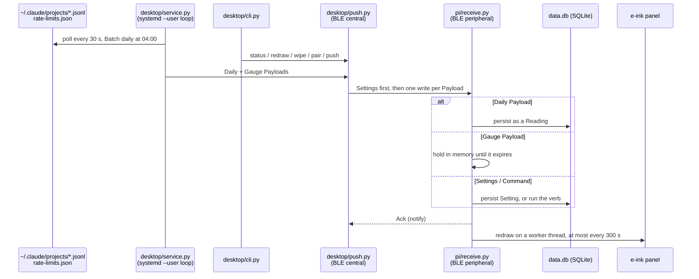

# zeropi.display

A Raspberry Pi Zero with a Waveshare e-ink HAT that shows **live Claude Code
usage**: a gauge of consumption against the rolling five-hour and seven-day
limit windows, backed by a history of daily cost — read from the local
Claude Code logs, with no API key.

A **Desktop** (the Linux machine you run Claude Code on) reads the usage and
pushes it over Bluetooth Low Energy to the **Pi**, which stores it and draws
the panel. [`CONTEXT.md`](CONTEXT.md) defines the vocabulary used here and
throughout the repo (Payload, Reading, Gauge, Batch, Ack, Setting, …).

## How it works



### The two roles

- **Desktop (BLE central)** — owns all the data. `usage.py` parses and
  de-duplicates the JSONL logs into a local SQLite archive and prices them;
  `gauge.py` reads the live rate-limit snapshot written by claude-hud and the
  active session's context. `push.py` is the BLE transport, `service.py` the
  resident loop that decides when to push, and `cli.py` the management
  surface.
- **Pi (BLE peripheral)** — a deliberately dumb receiver. It advertises one
  GATT service, accepts a Payload on its write characteristic, persists or
  acts on it, answers with an Ack on its notify characteristic, and redraws
  the panel. It never reads logs or computes usage, and it holds no wall-clock
  time: everything time-shaped arrives as a duration.

### What crosses the link

Four Payload kinds share one write characteristic, each ≤ 512 bytes:

| Kind | Carries | On the Pi |
|---|---|---|
| **Daily** | one day's usage for one project and model | stored as a **Reading** — the history the panel draws |
| **Gauge** | five-hour and seven-day consumption, reset countdowns, context size | held in memory only; expires 300 s after the snapshot was taken |
| **Settings** | the complete set of Pi Settings (today: `idle_keepalive_s`) | persisted, applied live without a restart |
| **Command** | one verb: `status`, `redraw` or `wipe` | answered in the Ack |

The Desktop re-asserts its Settings at the start of every connection, so
nothing is ever queued: a Pi that was off simply gets the current Settings
next time it is reached. A Pi is coupled to one Desktop at a time; when a
different Desktop connects, the Pi wipes its Readings and starts over.

### What the panel shows

A 250×122, 1-bit panel, always fully refreshed and never more than once per
300 s (the panel's rated wear limit):

- **Historic View** — the most recent active days, each with its cost. The
  resting frame.
- **Gauge frame** — the live gauge, whenever a fresh Gauge is held. An expired
  Gauge is never drawn; the panel falls back to the Historic View.
- **Startup** and **empty** frames — after a restart, and on a Pi with no
  Readings yet.

With nothing new to show, the Pi still redraws once a day (the keepalive
Setting) so the glass never looks frozen.

## Using it

Day to day the resident service does everything. `desktop/cli.py` is how you
check on it and manage it:

```bash
.venv/bin/python desktop/cli.py pair       # find the Pi, record its address, push the archive
.venv/bin/python desktop/cli.py status     # is it working? (--brief, --json)
.venv/bin/python desktop/cli.py push       # run a Batch now
.venv/bin/python desktop/cli.py redraw     # redraw the panel (queues behind the 300 s floor)
.venv/bin/python desktop/cli.py wipe       # repair: clear the Pi's Readings and re-push them
.venv/bin/python desktop/cli.py config     # list Configuration; config get/set <key> [value]
.venv/bin/python desktop/cli.py restart    # restart the resident service after a config change
```

`status` compares what the Desktop sent with what the Pi reports — coupling,
image version, panel health, Readings, coverage, restarts — and answers with
one of four states:

```
  ✓  Working.

  Desktop   zeropi-push running, up 3d 4h
            last Batch 2m ago, 15 Readings sent
  Pi        replied in 0.1s, up 1d 6h

  Coupled    ✓  replied, not wiped
  Image      ✓  schema 1
  Panel      ✓  historic frame, drew 2m 23s ago
  Readings   ✓  15
  Coverage   ✓  2026-09-04
  Restarted  ✓  up 1d 6h
```

| Exit | State |
|---|---|
| `0` | working |
| `1` | not working — a real fault |
| `2` | can't tell (Pi unreachable or the link busy) or not paired |
| `3` | refused — a bad value or key, or a command refused because the Pi is unreachable |

Configuration lives in `~/.config/zeropi-display/config.db`, in three tiers:
deployment facts (freely editable), policy (editable within validated
ranges), and verified invariants (shown read-only, never stored). Out-of-range
values are refused, never clamped.

`desktop/push.py` is the lower-level transport and still runs on its own
(`--dry-run`, `--batch-only`, `--gauge-only`, `--resend-all`).

## Repository layout

```
zeropi.display/
├── desktop/                     Desktop role — Python + bleak, Linux
│   ├── usage.py                 JSONL ingest, dedup and pricing; the Desktop's SQLite archive
│   ├── gauge.py                 Rate-limit snapshot + active session → Gauge Payload
│   ├── push.py                  BLE transport: scan, lock, Settings re-assertion, Batch and Gauge pushes
│   ├── service.py               Resident loop: 30 s poll, throttled Gauge pushes, daily Batch
│   ├── cli.py                   Management surface: status, config, pair, push, redraw, wipe, restart
│   ├── config.py                Configuration store and the tiered key schema
│   ├── verdict.py               Pure function: Desktop facts + Pi status → the status Verdict
│   ├── zeropi-push.service      systemd --user unit for service.py
│   ├── install-desktop.sh       Desktop provisioning (venv + bleak)
│   └── requirements*.txt        Runtime (bleak) and test (pytest) dependencies
│
├── pi/                          Pi role — Python + bluezero
│   ├── receive.py               GATT service: Payloads in, Acks out, Readings and Settings in SQLite
│   ├── render.py                Frame builders and the panel worker thread
│   ├── epd-selftest.py          Bench check that the panel draws (stop zeropi-display first)
│   ├── waveshare_epd/           Vendored Waveshare V4 driver, pinned — read its README before touching it
│   ├── install-pi.sh            Pi provisioning: BlueZ config, SPI, panel stack, fonts, systemd unit
│   ├── zeropi-display.service   systemd unit for receive.py
│   └── requirements.txt         bluezero, Pillow
│
├── tests/                       pytest suite — runs with no Pi, no panel, no BLE, no ~/.claude
├── docs/
│   ├── spec-usage-pipeline.md       Binding spec: reading, storing and pushing usage
│   ├── spec-eink-rendering.md       Binding spec: what the panel draws (supersedes parts of the above)
│   ├── spec-management-surface.md   Binding spec: Configuration, Settings, Commands, the CLI
│   ├── adr/                         Architecture decision records
│   └── *-verification.md            Hardware verification runs
├── install.sh                   curl bootstrap: fetches a versioned tarball and runs the role's installer
└── CONTEXT.md                   Domain vocabulary (binding)
```

## Hardware

| Component | Verified with |
|---|---|
| Pi | Raspberry Pi Zero 2 W, Debian 13 (trixie), Python 3.13, BlueZ 5.82 |
| Display | Waveshare 2.13" e-Paper HAT **V4**, 250×122, 1-bit |
| Link | the Pi's onboard Bluetooth; 517-byte ATT MTU, 512-byte Payloads and Acks |
| Desktop | Linux with BlueZ and `systemd --user` (verified on Pop!_OS 24.04, Python 3.12) |

Everything above is verified on real hardware, not simulated — each
`docs/*-verification.md` is one such run: the BLE link, real usage data over
it, unattended provisioning and reboot survival, frames on real glass, and the
management surface end to end.

## Setup

### Pi

Run on the Pi itself — no clone needed:

```bash
curl -fsSL https://raw.githubusercontent.com/peterderkoala/zeropi.display/dev/install.sh | bash -s -- pi
```

It re-execs itself under `sudo` where it needs root, configures BlueZ
(including the `bluetoothd` plugin exclusion the link depends on), enables
SPI, installs the panel stack and fonts, and starts `zeropi-display` under
systemd. Safe to re-run: an existing `data.db` is kept.

### Desktop

From a clone:

```bash
uv venv .venv && uv pip install -r desktop/requirements.txt
.venv/bin/python desktop/cli.py pair
```

To run the resident service, copy `desktop/zeropi-push.service` to
`~/.config/systemd/user/`, point its `ExecStart` at
`<clone>/.venv/bin/python3 <clone>/desktop/service.py` (the unit's own
comments walk through this), then `systemctl --user enable --now zeropi-push`.

The live Gauge needs [claude-hud](https://github.com/jarrodwatts/claude-hud)
writing its rate-limit snapshot to
`~/.local/state/zeropi-display/rate-limits.json`
(`display.externalUsageWritePath` in claude-hud's config). It only updates
while an interactive Claude Code session is open; without it, the panel shows
the Historic View.

> The curl bootstrap also has a `desktop` role
> (`… | bash -s -- desktop`). Inside a clone it sets up `.venv` in place; its
> standalone mode currently deploys only `push.py`, so use a clone for the
> service and the CLI.

### Tests

```bash
uv pip install -r desktop/requirements-dev.txt
.venv/bin/python -m pytest
```
