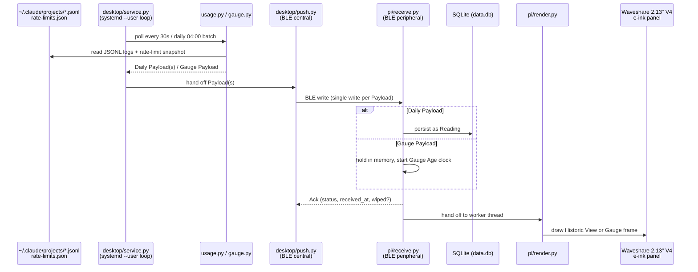

# zeropi.display

A Pi Zero e-ink display that shows **live Claude Code usage** — a gauge of
current consumption against the rolling rate-limit windows, backed by a
daily history graph — read straight from local Claude Code session data
(JSONL logs) rather than a paid API key.

It reuses existing pwnagotchi Pi Zero + Waveshare e-ink HAT hardware. See
[`pi-eink-ble-concept.md`](pi-eink-ble-concept.md) for the full concept and
[`CONTEXT.md`](CONTEXT.md) for the binding domain vocabulary (Desktop, Pi,
Payload, Reading, Ack, Gauge, …) used throughout this repo and its docs.

> ⚠ Weather, calendar and an AI-generated one-liner were part of the original
> concept and were dropped from the project on 2026-09-09. Usage is the whole
> product now. Older documents that still frame this as a daily summary of
> those three are historical record, not current scope.

## Concept

Two roles, connected over Bluetooth Low Energy:

- **Desktop (BLE central)** — any Linux machine running Claude Code. Owns the
  real data: it parses the local `~/.claude/projects/*.jsonl` logs and a
  live rate-limit snapshot, and pushes that data to the Pi over BLE. A Pi is
  coupled to one Desktop at a time, but that Desktop is replaceable.
- **Pi Zero (BLE peripheral)** — the e-ink display. A dumb receiver: it
  advertises a GATT service, accepts a Payload write, persists it (or not,
  depending on shape), returns an Ack, and redraws the panel. It never
  fetches or computes usage data itself.

Two Payload shapes travel over a single write characteristic:

- **Daily Payload** — one day's usage for one project and model. Persisted
  on the Pi as a **Reading**, the durable history behind the graph.
- **Gauge Payload** — the live gauge: consumption against the rolling
  five-hour and seven-day limit windows, plus the active session's context
  size. Display-only; the Pi never stores it, and it expires after 300 s of
  no fresh Gauge if not refreshed.

The Pi renders a 250×122, 1-bit Waveshare e-ink panel: the **Historic View**
(the most recent Active Days, each with its cost) at rest, replaced by the
**Gauge frame** whenever a live Gauge is fresh.

## Flow



## Directory spec

```
zeropi.display/
├── desktop/                     Desktop role (BLE central), Python + bleak
│   ├── usage.py                 Reads/dedups/costs Claude Code JSONL logs; maintains the Desktop store
│   ├── gauge.py                 Reads the rate-limit snapshot + live session registry; builds a Gauge Payload
│   ├── push.py                  BLE transport: Batch loop over Daily Payloads, single Gauge pushes, Ack handling
│   ├── service.py               Resident systemd --user loop: owns cadence (30s poll, 04:00 batch, throttles)
│   ├── install-desktop.sh       Desktop provisioning (stubbed, see #34)
│   ├── zeropi-push.service      systemd --user unit for service.py
│   ├── requirements.txt         Runtime deps (bleak)
│   └── requirements-dev.txt     Test deps (pytest, etc.)
│
├── pi/                          Pi role (BLE peripheral), Python + bluezero
│   ├── receive.py               GATT service: accepts Payload writes, persists Readings, returns Acks,
│   │                            owns the panel and hands frames to the render worker thread
│   ├── render.py                Builds e-ink frames: Historic View, Gauge frame, expiry fallback, startup draw
│   ├── epd-selftest.py          Bench check that the panel draws (stop the service first — it owns the panel)
│   ├── install-pi.sh            Pi provisioning: BlueZ config, SPI, e-ink driver stack, systemd units
│   ├── waveshare_epd/           Vendored Waveshare V4 e-ink driver (pinned upstream commit — see its README)
│   ├── requirements.txt         Runtime deps (bluezero, Pillow)
│   └── zeropi-display.service   systemd unit for receive.py
│
├── docs/
│   ├── spec-usage-pipeline.md       Binding spec for the Desktop usage pipeline
│   ├── spec-eink-rendering.md       Binding spec for panel rendering (supersedes parts of the above)
│   ├── adr/                         Architecture decision records
│   ├── agents/                      Conventions for AI-agent workflows in this repo
│   └── *-verification.md            Hardware verification run logs
│
├── tests/                       pytest suite (root pytest.ini sets pythonpath = desktop)
├── handoff/                     Continuity document between work sessions (handoff.md) + archive
├── install.sh                   Repo-root curl bootstrap; fetches a versioned tarball, delegates by role
├── CONTEXT.md                   Domain vocabulary (binding)
├── pi-eink-ble-concept.md       Original concept document
└── infrastructure.md            Dev hardware details (gitignored, not tracked)
```

## Tested hardware

| Component | Verified as |
|---|---|
| Pi | Raspberry Pi Zero 2 W, Rev 1.0, Debian 13 (trixie), Python 3.13.5, BlueZ 5.82 |
| Display | Waveshare 2.13" e-Paper HAT **V4**, 250×122 landscape, 1-bit (no grey) — driver vendored at a pinned commit in `pi/waveshare_epd/` |
| BLE | Pi's onboard Bluetooth chip; single-write Payloads confirmed within its MTU/link-layer limits |
| Desktop | Any Linux box running Claude Code (Desktop role is Linux-only — `push.py` uses a private BlueZ-specific `bleak` API, see #32) |

All of the above is verified end-to-end on real hardware, not simulated: see
`docs/e2e-verification.md` (BLE link), `docs/usage-pipeline-verification.md`
(real usage data over the link), `docs/provisioning-verification.md`
(unattended install, reboot and `bluetoothd`-restart survival), and
`docs/eink-rendering-verification.md` (frames drawn on real glass).

## Setup

### Pi (run on the Pi itself)

No `git` or clone needed — fetches a versioned tarball of the `dev` branch
and provisions everything, including BlueZ configuration the BLE link
depends on:

```bash
curl -fsSL https://raw.githubusercontent.com/peterderkoala/zeropi.display/dev/install.sh | bash -s -- pi
```

Runs unprivileged and re-execs itself under `sudo` where it needs root
(systemd units, BlueZ config, SPI). Safe to re-run — it never touches an
existing `data.db`.

### Desktop (run on the machine that will push)

```bash
curl -fsSL https://raw.githubusercontent.com/peterderkoala/zeropi.display/dev/install.sh | bash -s -- desktop
```

Auto-detects whether it's running inside an existing clone (sets up `.venv`
in place) or standalone (installs to `~/.local/share/zeropi-display/` with a
`zeropi-push` shim on `PATH`). Override with `--in-place` or `--prefix <dir>`
appended after `desktop`. Override the fetched ref with
`ZEROPI_REF=<branch-or-sha>` before the pipe. Desktop-only, Linux-only.

### Manual dev setup (Desktop)

```bash
uv venv .venv && uv pip install -r desktop/requirements.txt
.venv/bin/python desktop/push.py
```

### Tests

```bash
uv pip install -r desktop/requirements-dev.txt
.venv/bin/python -m pytest
```
